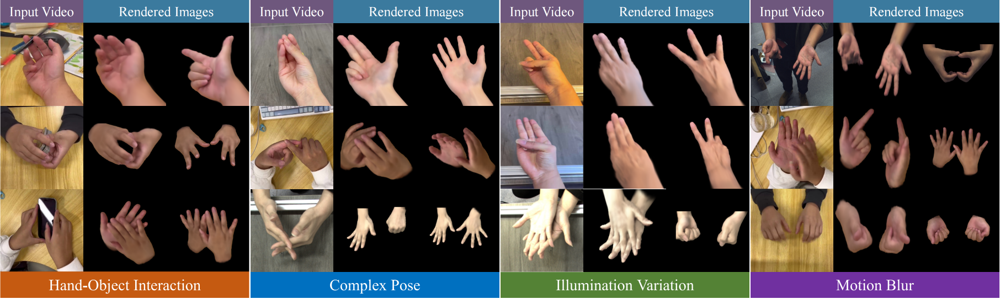

# WildGHand: Learning Anti-Perturbation Gaussian Hand Avatars from Monocular In-the-Wild Videos

This is the official implementation of "[WildGHand: Learning Anti-Perturbation Gaussian Hand Avatars from Monocular In-the-Wild Videos](https://arxiv.org/abs/2602.20556)".

<p>
   
</p>

The code is released on GitHub. Large datasets, checkpoints, and model weights are hosted separately on Hugging Face.

## Installation

1. Create the conda environment using the provided env list:

   ```bash
   conda env create -f environment.yml
   conda activate interhand
   ```

2. Check that the environment is available:

   ```bash
   conda env list
   ```

   Expected output style:

   ```text
   # conda environments:
   #
   base                  /path/to/miniconda3
   interhand          *  /path/to/miniconda3/envs/interhand
   ```

3. Verify the PyTorch and CUDA installation:

   ```bash
   python -V
   python - <<'PY'
   import diffusers
   import huggingface_hub
   import torch
   print("torch", torch.__version__)
   print("diffusers", diffusers.__version__)
   print("huggingface-hub", huggingface_hub.__version__)
   print("cuda available", torch.cuda.is_available())
   print("gpu count", torch.cuda.device_count())
   for i in range(torch.cuda.device_count()):
       print(i, torch.cuda.get_device_name(i))
   PY
   ```

The released checkpoints were tested with Python 3.9.12, PyTorch 1.11.0, CUDA toolkit 11.3, pytorch-lightning 1.6.5, diffusers 0.21.4, huggingface-hub 0.19.4, and transformers 4.33.0.

## Data preparation

Download the WildGHand dataset from [Hugging Face Datasets](https://huggingface.co/datasets/XuanHuang0/WildGHand) and place it under `$ROOT/dataset/WildGHand/`.

Expected directory layout:

```text
WildGHand/
  dataset/
    WildGHand/
      capture0_subsample3_single/
      capture1_subsample2_single/
      capture4_subsample4/
      ...
```

The default configs point to paths under `dataset/WildGHand/`.

## Pre-trained model

Download the checkpoint bundle from [Hugging Face Models](https://huggingface.co/XuanHuang0/WildGHand-checkpoints/tree/main/EXPERIMENTS/checkpoints) and place it in the repository root:

```bash
python -m huggingface_hub.commands.huggingface_cli download \
  XuanHuang0/WildGHand-checkpoints \
  --repo-type model \
  --local-dir .
```

Expected checkpoint layout:

```text
WildGHand/
  vit_h.pth
  EXPERIMENTS/
    checkpoints/
      0.ckpt
    c0_single/
      ckpts/
        last.ckpt
    c4_multi/
      ckpts/
        last.ckpt
```

The code also supports custom asset paths through environment variables:

```bash
export WILDG_HAND_ASSET_ROOT=/path/to/assets
export WILDG_HAND_SAM_CHECKPOINT=/path/to/vit_h.pth
export WILDG_HAND_PRETRAINED_CKPT=/path/to/0.ckpt
```

## Training and evaluation

### Single-sequence training

```bash
CUDA_VISIBLE_DEVICES='0' python -m wildghand.train_single --config configs/train_treg_tsp10.yaml --config_hand configs/hand_single_c0.json
```

### Single-sequence validation

```bash
CUDA_VISIBLE_DEVICES='0' python -m wildghand.train_single --config configs/eval_nt_tsp10.yaml --config_hand configs/hand_single_c0.json --run_val
```

### Multi-sequence training

```bash
CUDA_VISIBLE_DEVICES='0,1,2,3' WILDG_HAND_NUM_GPUS='4' python -m wildghand.train_multi --config configs/train_treg_tsp10.yaml --config_hand configs/hand_multi_c4.json --num_gpus 4
```

### Multi-sequence validation

```bash
CUDA_VISIBLE_DEVICES='0' python -m wildghand.train_multi --config configs/eval_nt_tsp10.yaml --config_hand configs/hand_multi_c4.json --run_val
```

The multi-GPU training command expects four visible GPUs. Some CUDA extensions, such as pointnet2 ops, may JIT-compile on first run.

## Acknowledgements

Parts of this codebase are adapted from [livehand](https://github.com/amundra15/livehand), [TriplaneGaussian](https://github.com/VAST-AI-Research/TriplaneGaussian), and [GuassianHand](https://github.com/XuanHuang0/GuassianHand). We appreciate their contributions and encourage citing them where appropriate.
